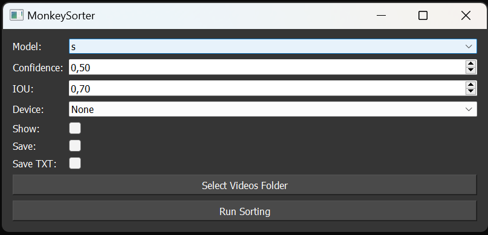

# MonkeySorter
MonkeySorter is a video sorting tool that uses the last YOLOv8 architecture (You Only Look Once) to detect and classify videos containing monkeys from videos that do not. With MonkeySorter, you can quickly sort through a large collection of videos, saving you time and effort.



- Git
- Python 3.x
- CUDA, cuDNN, and compatible GPU (if you plan to use GPU for inference)

## Installation

1. Clone the repository:

```bash
git clone https://github.com/quentinbacquele/MonkeySorter.git
``` 
2. Install PyTorch with the correct CUDA, cuDNN, and GPU support. Follow the instructions on the [official PyTorch website](https://pytorch.org/get-started/locally/).

3. Install Ultralytics:

```bash
pip install ultralytics
```
4. Install the required dependencies:

```bash
cd MonkeySorter
pip install -r requirements.txt
```
## Usage 

Run the `sorter.py` script in the command prompt:
```bash
python sorter.py
``` 

### App Instructions

- **Model**: Choose the model for detection. The smaller the model, the faster the inference. The larger the model, the better the accuracy.
- **Confidence Threshold**: Set the confidence threshold for detection.
- **IOU Threshold**: Set the intersection-over-union (IOU) threshold for non-maximum suppression (NMS).
- **Show**: Check this box to show the video with detections in real-time.
- **Save**: Check this box to save the videos with monkey detections.
- **Save TXT**: Check this box to save the detection results, including bounding box coordinates, in a text file.


